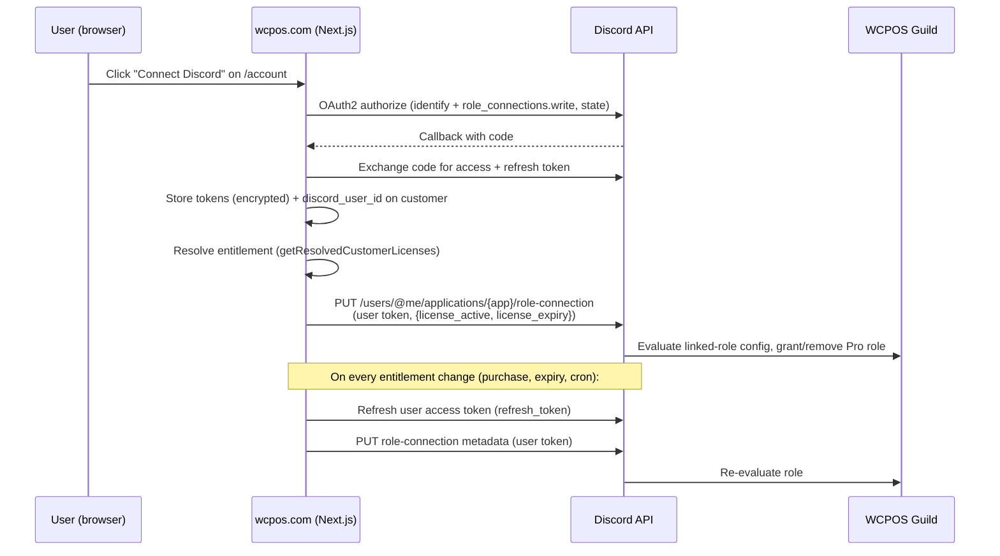
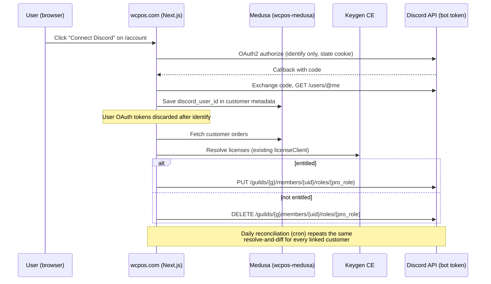

# WCPOS Discord Pro-Role Sync Design
**Date:** 2026-06-10
**Status:** Design proposal (no implementation yet)
**Primary Goal:** Users who link their Discord account to their wcpos.com account automatically receive a "Pro" role in the WCPOS Discord server while they hold an active Pro license, and lose it when the license expires.

---

## Goals

1. A wcpos.com customer can link their Discord account from the account area, or starting from Discord via the bot.
2. A linked customer with an **active Pro entitlement** holds the Pro role in the WCPOS guild.
3. When the entitlement lapses (expiry, refund), the Pro role is removed without manual admin work.
4. Role state converges automatically after purchases, renewals, expiries, and unlink — within at most one reconciliation cycle.
5. Reuse the site's existing entitlement resolution; introduce **no second definition** of "active license".

## Non-Goals

- Discord as a **login method** for wcpos.com (no new Medusa auth provider; linking only).
- Syncing any role other than Pro (free members keep whatever the guild grants by default).
- Real-time presence/usage features, Discord-side support tooling, or chat integrations.
- Multi-guild support in v1 (the design must not preclude it).

## Glossary

| Term | Meaning |
|---|---|
| **Linked Account** | A verified association between a Medusa customer and a Discord user ID, created via Discord OAuth (`identify` scope). |
| **Entitlement** | The boolean "this customer currently has Pro": derived from `getResolvedCustomerLicenses()` — at least one license with `status === 'active'` and expiry in the future (or null). |
| **Role Sync** | The act of making the Discord guild role match the entitlement for one linked account: add Pro role if entitled, remove if not. |
| **Reconciliation** | A scheduled job that performs Role Sync for *all* linked accounts, catching passive changes (expiry) and missed events. |

---

## System Context (verified in code)

- **Site:** Next.js on Vercel. Customer auth is Medusa v2 JWT (`src/lib/medusa-auth.ts`). OAuth login for Google/GitHub goes through Medusa auth provider routes (`src/app/api/auth/[provider]/route.ts`, `ALLOWED_PROVIDERS = ['google', 'github']`).
- **Entitlements:** `getResolvedCustomerLicenses()` (`src/lib/customer-licenses.ts`) reads the authenticated customer, pulls their Medusa orders, extracts license references from order metadata (`src/lib/licenses.ts`), and resolves each against Keygen CE via `licenseClient` (`src/services/core/external/license-client.ts`). Keygen flips license `status` to `expired` after the expiry date passes.
- **Purchase path:** checkout completes server-side at `src/app/api/store/cart/complete/route.ts` — a natural purchase/renewal hook inside wcpos-com.
- **Backend:** Medusa v2 in the separate `wcpos-medusa` repo (Hetzner/Coolify). Scheduled jobs can live there (Medusa scheduled jobs) or as Vercel cron hitting a protected wcpos-com route.
- **Keygen CE:** self-hosted; webhooks **are** available in CE (not EE-gated), including `license.expired` and `license.expiring-soon`. Caveat: `license.expired` fires via background jobs (Sidekiq), not instantly at the expiry timestamp.

---

## Discord Mechanisms (2026)

Two officially supported approaches:

**1. Linked Roles (role connections).** The app registers up to **5 metadata fields** (boolean / integer / ISO8601 date, e.g. `license_active`, `license_expiry`). The user authorizes the app with `identify` + `role_connections.write`. The app then pushes metadata for that user via `PUT /users/@me/applications/{app_id}/role-connection` — **using the user's OAuth access token**, not a bot token. Guild admins configure a role requirement ("license_active = true") in server settings; Discord grants/removes the role based on the latest pushed metadata. Important correction to the common mental model: **Discord does not pull from the app.** The app must push on every change, which means storing and refreshing every user's OAuth token (access tokens expire in ~7 days; refresh tokens last until revoked).

**2. Bot-managed roles.** A bot in the guild with `Manage Roles` permission adds/removes the role directly: `PUT/DELETE /guilds/{guild_id}/members/{user_id}/roles/{role_id}`, authenticated with the **bot token**. No per-user tokens. No gateway connection required — plain REST calls work, and slash commands can be served over the Interactions HTTP endpoint (signed webhooks) rather than a persistent websocket.

---

## Candidate Architectures

### Option A — Discord Linked Roles



- **Where state lives:** entitlement metadata lives on Discord's side; the role-to-metadata mapping lives in guild settings (admin UI), outside version control.
- **Token burden:** we must persist an encrypted access/refresh token pair **per linked user, forever**, refresh on a 7-day cycle or on demand, and handle revocation (user de-authorizes the app → pushes fail permanently until they re-link).
- **Leave/rejoin:** handled well — Discord re-applies the linked role from stored metadata on rejoin, no action from us.
- **Multi-guild:** good — any guild can add a requirement on our metadata without us doing anything.
- **Failure modes:** silent staleness. If a refresh token is revoked or a push fails, the user keeps (or misses) the role with no error surfaced in our system unless we track push failures per user.

### Option B — Bot-managed roles (recommended)



- **Where state lives:** the link (`discord_user_id`) lives on our customer record; the role itself is the only Discord-side state, and it is fully derivable from our data — the reconciliation job can always rebuild it.
- **Token burden:** none per user. One bot token in server env. The user's OAuth token is used once to read their Discord ID, then discarded.
- **Leave/rejoin:** role is lost on leave (Discord drops roles); the next reconciliation run (or manual resync) re-adds it. A short gap is acceptable for this perk.
- **Multi-guild:** add a `(guild_id, role_id)` pair per guild and loop — straightforward.
- **Failure modes:** loud and recoverable. API errors are visible in our logs; reconciliation is idempotent, so any missed sync self-heals on the next run.
- **Rate limits:** Discord global limit is 50 req/s; role add/remove has per-guild route buckets. A daily reconciliation over even a few thousand linked members at ~5 req/s with 429 backoff completes in minutes. Not a constraint at WCPOS community scale.

### Recommendation: Option B

Option A's headline benefit (Discord re-applies the role on rejoin) does not outweigh its cost: a permanent, per-user encrypted token store with a refresh loop, silent-failure modes, and role configuration living in the Discord admin UI instead of our code. Option B keeps **all durable state in Medusa**, needs exactly one secret, and its failure mode is "role is stale until the next idempotent reconciliation" — which we need anyway for expiry. Option B is also the only option that lets the bot answer "is this Discord user linked?" for Discord-initiated linking.

---

## Linking UX

### From the website (`/account`)

1. New "Connected accounts" card on `/account/profile` with a **Connect Discord** button → `GET /api/discord/link` (site-owned route; deliberately *not* under `/api/auth/[provider]` since this is account linking, not login).
2. Route requires an authenticated Medusa session, sets a random `state` cookie, redirects to Discord authorize with `scope=identify`.
3. Callback verifies `state`, exchanges the code, calls `GET /users/@me`, stores the link, discards tokens, runs an immediate Role Sync, redirects back to `/account/profile?discord=linked`.
4. Card then shows the linked Discord username/avatar, a **Resync** button, and **Disconnect**.

### From Discord (bot command)

1. User runs `/link` in the WCPOS guild. The bot (Interactions HTTP endpoint — a Next.js route with ed25519 signature verification, no gateway process needed) replies **ephemerally** with a link to `https://wcpos.com/account/profile?connect=discord`.
2. That page (after login if needed) starts the same OAuth flow as above. OAuth proves Discord identity cryptographically, so no one-time code is required in the happy path.
3. *(Phase 2, optional)* `/link` can also mint a one-time 10-minute code bound to the invoking Discord user ID for users who prefer typing a code on the account page; this skips the second OAuth hop but adds code storage/expiry logic. Not needed for MVP.

### Where the Discord identity is stored — recommendation: customer metadata

| | Customer `metadata` (recommended) | Separate table (custom Medusa module) |
|---|---|---|
| Effort | None — Medusa update-customer call | New module + migration in wcpos-medusa |
| Uniqueness (1 Discord ↔ 1 customer) | Enforced in app code at link time | DB unique constraints |
| Reverse lookup (discord_id → customer) | Paginated scan of customers | Indexed query |
| Precedent | Licenses already resolve from order metadata | — |

Store on the Medusa customer: `metadata.discord_user_id`, `metadata.discord_username`, `metadata.discord_linked_at`. At expected scale (hundreds of linked users), the reconciliation job paginating the admin customers API and filtering in memory is fine. If linked-user count grows past a few thousand, or we need hard uniqueness guarantees, promote to a `customer_discord_link` table in `wcpos-medusa` (Phase 2+ decision; the metadata keys migrate trivially).

---

## Sync Triggers

| Trigger | Mechanism | Latency |
|---|---|---|
| **On link / unlink** | Inline in the OAuth callback / disconnect handler | Immediate |
| **On purchase / renewal** | Hook at the end of `src/app/api/store/cart/complete/route.ts`: if the customer has a Discord link, fire-and-forget Role Sync (must never block or fail checkout) | Seconds |
| **On expiry** (the hard one) | **Daily reconciliation job** — licenses expire passively; nothing fires in our stack. Plus optional Keygen webhooks (below) | ≤ 24 h, or minutes with webhooks |
| **Manual** | **Resync** button on the account card; also useful for support | Immediate |

### Reconciliation job (the backbone)

- **What:** a two-direction sweep, so the role converges from both sides. **(a) Linked customers:** list all customers with `metadata.discord_user_id` → resolve entitlement per customer (same chain as `getResolvedCustomerLicenses`) → compare with current guild role membership → add/remove role where they differ. **(b) Current role holders:** enumerate guild members who currently hold the Pro role (`GET /guilds/{g}/members` filtered by role, paginated) → any holder with no linked customer, or whose linked customer is not entitled, gets the role removed. Sweep (b) is what catches unlinked-but-still-holding members (failed unlink role-removal, manual role grants, links deleted out-of-band) — sweep (a) alone can never see them. Both directions are idempotent; safe to run at any frequency.
- **Where:** **Vercel cron → protected wcpos-com route** (`/api/discord/reconcile`, guarded by `CRON_SECRET`). Rationale: all the resolution code (`licenseClient`, order extraction) already lives in wcpos-com; putting the job in wcpos-medusa would duplicate it. Vercel function time limits are fine at this scale; if runtime ever becomes an issue, move the job to a wcpos-medusa scheduled job and expose the resolution via an internal endpoint.
- **Cadence:** daily (e.g. 03:00 UTC). Expiry precision of "within a day" matches the perk's stakes. Tighten to 6-hourly later if desired.

### Keygen webhooks (optional accelerator, verified available in CE)

Keygen CE ships the same webhook system as Keygen Cloud — `license.expired`, `license.expiring-soon`, `license.created`, etc. are available self-hosted. We can register a webhook endpoint (`/api/webhooks/keygen`) and on `license.expired`, look up the owning customer (license key → order metadata mapping, or license metadata) and trigger a targeted Role Sync. Caveats: `license.expired` fires from background jobs, so it is near-real-time, not exact; and the customer lookup from a bare license event needs a key→customer mapping. **Treat webhooks as a Phase 2 latency optimization; reconciliation remains the correctness guarantee.**

---

## Entitlement Source of Truth

The design **reuses** the existing resolution and adds no second definition:

```
hasActiveProEntitlement(licenses) :=
  licenses.some(l => normalizeStatus(l.status) === 'active' && (l.expiry === null || l.expiry > now))
```

**Status must be normalized (lowercased) before the check.** The two Keygen resolution paths disagree today: `validateLicenseKey` lowercases `status` before returning, but the by-ID path (`licenseClient.getLicenseWithMachines` → `mapLicenseData`) preserves Keygen's raw casing. Without normalization, an active license resolved by ID would be denied the role. Normalize once, inside the entitlement helper — do not rely on callers.

where `licenses` come from the exact pipeline in `src/lib/customer-licenses.ts` (Medusa orders → `extractLicenseReferencesFromOrders` → Keygen resolution). Required refactor (not redefinition): extract a parameterized `getResolvedLicensesForCustomer(customerId)` from `getResolvedCustomerLicenses()` so the reconciliation job and webhook handler can resolve entitlements for customers other than the cookie-authenticated one. The cookie-based function becomes a thin wrapper. `status: 'unknown'` placeholders (Keygen unreachable) count as **not entitled for adding** but **never trigger removal** — see failure handling.

---

## Security

- **OAuth state/CSRF:** random `state` in an httpOnly, `SameSite=Lax`, short-TTL cookie; verified on callback; flow bound to the authenticated Medusa session (linking is rejected if the session user changed mid-flow).
- **Token storage:** with Option B, user OAuth tokens are held in memory for the duration of the callback only and never persisted. Persistent secrets are limited to: `DISCORD_BOT_TOKEN`, `DISCORD_CLIENT_SECRET`, `DISCORD_PUBLIC_KEY` (interactions signature check), `CRON_SECRET` — all server-side env vars (Vercel encrypted env), never exposed to the client.
- **Unlink flow:** "Disconnect" on the account card → confirm → best-effort role removal → delete the `discord_*` metadata keys → audit log entry. Unlink succeeds even if the Discord role-removal call fails (reconciliation note: an orphaned role with no link is removed per the role-ownership policy below).
- **Compromised bot token blast radius:** the bot can act with whatever guild permissions it has. Mitigation = least privilege: grant **only `Manage Roles`**, no admin/kick/ban/message permissions; place the bot's highest role immediately above the Pro role in the hierarchy (it can then only manage Pro and below); single guild install; rotate the token from the Developer Portal if leaked. Worst case with this setup: an attacker grants/removes Pro role and roles below it — annoying, not destructive.
- **Interactions endpoint:** verify Discord's ed25519 signature on every request (required by Discord; also prevents spoofed `/link` calls).
- **Webhook endpoint (if Phase 2):** verify Keygen webhook signatures; treat payloads as untrusted hints and re-resolve entitlement from Keygen before acting.

---

## Failure & Edge Cases

| Case | Behavior |
|---|---|
| **User not in guild** | Role add returns 404 Unknown Member. Store the link anyway, surface "Join the Discord server to receive your role" with an invite link on the account card; reconciliation adds the role after they join (≤ 1 cycle, or instant via Resync). |
| **User leaves and rejoins** | Discord drops the role on leave; next reconciliation re-adds it. Acceptable gap; document it. |
| **Role manually granted by admin** | Policy: the **Pro role is bot-owned** — reconciliation removes it from members without an entitled link. Admins who want to comp someone should use a separate manually-managed role (e.g. "Pro (honorary)") with the same channel permissions. This keeps reconciliation logic trivial and avoids an allowlist. |
| **One Discord account, multiple wcpos accounts** | Reject at link time: before saving, check no other customer holds this `discord_user_id` (in-memory scan, same as reconciliation). Offer "move link" with explicit confirmation (unlinks the old customer first). |
| **One wcpos account, multiple Discord accounts** | Not supported: one link per customer; linking a new Discord account replaces the old one (with role removal for the old ID). |
| **Banned user** | Role calls fail / member absent; log and skip. The link remains; entitlement is unaffected (their license is still valid in the app). |
| **Discord API downtime** | In-line syncs (link, purchase) retry briefly (2–3 attempts, exponential backoff on 429/5xx) then give up — **no durable queue in MVP**, because reconciliation is the durable retry: every state change is re-derived and re-applied on the next run. |
| **Keygen unreachable during reconciliation** | Licenses resolve to `unknown` placeholders → skip that customer entirely (never remove a role on missing data); alert if the whole run degrades. |
| **License refunds** | Refund → license should be revoked/suspended in Keygen (existing or to-be-confirmed back-office process — see open questions); once Keygen status ≠ active, the next reconciliation removes the role. Optional Phase 2: Medusa refund event triggers targeted sync. |
| **Customer deleted / GDPR erasure** | Link metadata dies with the customer record; reconciliation removes the orphaned role (bot-owned policy). |

---

## Phased Rollout

### Phase 1 — MVP (est. 3–5 dev days)

1. Discord application + bot setup, guild role + permission hierarchy (0.5 d).
2. Link/unlink OAuth flow + account card UI (`/api/discord/link`, callback, profile card) (1–1.5 d).
3. `getResolvedLicensesForCustomer` refactor + `hasActiveProEntitlement` helper + Role Sync service (Discord REST client with backoff) (1 d).
4. Purchase hook in cart-complete + manual Resync endpoint/button (0.5 d).
5. Reconciliation route + Vercel cron + `CRON_SECRET` + structured logging (1 d).
6. Tests: unit (state/CSRF, entitlement mapping, sync diffing with mocked Discord/Keygen), E2E for the account card (0.5–1 d, overlapping).

**Exit criteria:** linking from /account works; buying Pro grants the role within seconds; an expired test license loses the role on the next cron run; resync button works.

### Phase 2 — Automation & polish (est. 3–4 dev days)

1. `/link` slash command via Interactions endpoint (signature verification, ephemeral reply) (1 d).
2. Keygen webhooks (`license.expired`, `license.expiring-soon`) → targeted sync for near-real-time expiry (1 d).
3. Medusa refund/cancel event → targeted sync (0.5 d).
4. Operational dashboard bits: reconciliation run summary (added/removed/skipped counts) to logs/PostHog, alert on consecutive failures (0.5 d).
5. Optional: one-time-code linking variant; promote link storage to a dedicated table if scale demands (deferred until needed).

---

## Success Criteria

- 0 manual role grants/removals needed by admins after launch (excluding the honorary role).
- Role state for every linked member matches entitlement within 24 h at all times (within seconds for purchases).
- No checkout latency or failure attributable to the Discord hook.
- A single env-var kill switch (`DISCORD_SYNC_ENABLED`) disables all Discord calls instantly.

---

## Open Questions for the Owner

1. **Guild details:** confirm the guild ID, whether a "Pro" role already exists, and what it should unlock (private channels? priority support channel?). Stakes of a stale role inform cron cadence.
2. **Expiry grace period:** remove the role immediately at expiry, or keep it for N days as a renewal nudge ("your Pro role expires in 3 days — renew")? Default in this design: immediate (next daily run).
3. **Refund handling:** is there an existing process that suspends/revokes the Keygen license on refund? If not, role removal on refund silently won't happen until that exists — should refund-driven revocation be in scope?
4. **Reconciliation cadence:** is daily acceptable, or should expiry be enforced within hours (→ 6-hourly cron or Phase 2 webhooks pulled into MVP)?
5. **Discord as login (future):** should the Discord identity eventually double as a wcpos.com login method (Medusa auth provider)? Affects whether we keep the link in customer metadata or move it into the auth-identity model sooner.
6. **Bot ownership:** create the Discord application under a WCPOS team account (recommended, survives personnel changes) — who owns/administers it?
7. **Honorary Pro:** is a separate admin-managed role for comped community members acceptable, or must admins be able to hand out the synced Pro role itself (which would require an allowlist in reconciliation)?

---

## References

- Discord application role connection metadata: https://docs.discord.com/developers/resources/application-role-connection-metadata
- Discord Linked Roles tutorial: https://docs.discord.com/developers/tutorials/configuring-app-metadata-for-linked-roles
- Keygen self-hosting (CE/EE feature split — webhooks in CE): https://keygen.sh/docs/self-hosting/
- Keygen webhooks (incl. `license.expired` semantics): https://keygen.sh/docs/using-webhooks/ and https://github.com/orgs/keygen-sh/discussions/131
- Entitlement pipeline: `src/lib/customer-licenses.ts`, `src/lib/licenses.ts`, `src/services/core/external/license-client.ts`
- Purchase hook point: `src/app/api/store/cart/complete/route.ts`
